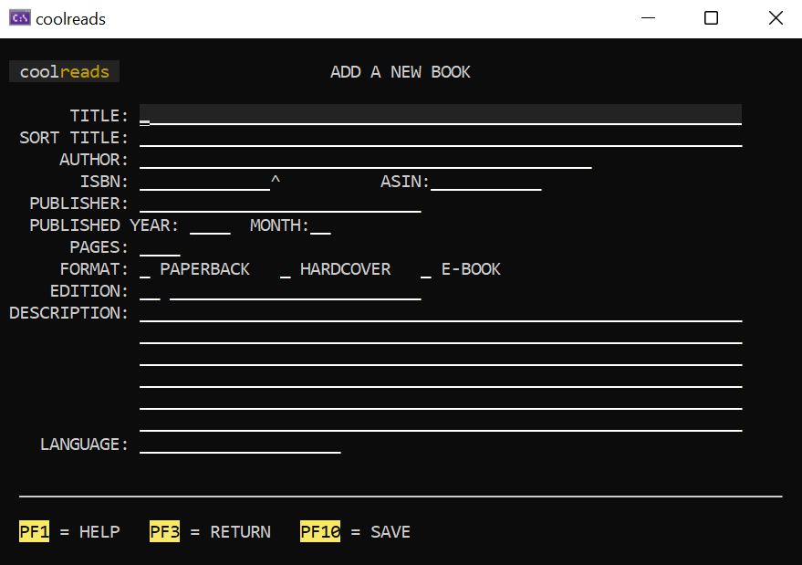

Mainframe is a simple visual user interface toolkit for developing mainframe-alike console applications in .NET

## Why the Console?

Since the raise of the graphical user interface, the development of new console-based applications has been in decline, most often relegated to IT related work. GUI applications are visually more interesting, may provide richer data, be easier to use since you can just click wherever you want/need and be more appealing to users than applications based only on a set of characters laid on a (mostly) black and white (some times green) screen. So why would anyone bother to develop another console applications nowadays?

Anyone who has already developed a modern rich web/desktop/mobile application know the effort one must go through to get the UI right: control placements, in-place validations, screen navigation, colours, images, icons, animations, and even when you don't have to develop the entire set of the visual experience of the application you still have to waste a lot of effort learning how to apply it correctly to get the desired visual results. It takes time, effort, most times a team composed of multiple people for front-end and back-end development due to using different technologies and development and maintenance times can easily go through the roof.

Developing console-based applications weren't easier either, with the developer having to fine control where to "draw" the screen, where (and when) to capture user input, and so forth. But back in 2004 I had an experience with a development tool for mainframe applications called **CSP** that amazed me for the ability it provided to build an entire screen by literally writing how it would look like in plain text. The concept has been in the back of my head since then and I've even given lots of thought it could be interesting to develop applications for common platforms like that but never actually minded to work on anything like it until now.

 

Thus here is Mainframe, a small framework intended to help creating console based applications that could be used either locally (for testing concepts, business logic, personal utilities and so forth) or remotely (through an SSH connection) to an even larger audience. Developing an application using Mainframe is good because:

1. It is easier and faster to develop applications (especially for developers) when you can see the exact outcome screens of your software, graphical user interfaces are all about this. It takes almost no code at all to get a screen up and running.

2. Because it has fewer capabilities (in terms of visual) than other UI alternatives, you tend to waste less time and effort to build a functional application with a better looking UI than you can achieve using `Console.Write()` only, for example (you may try out [Miguel de Icasa's **gui.cs**](https://github.com/migueldeicaza/gui.cs), it is more visually appealing but more verbose in code and you still only get to see the resulting screen when you run your application).

3. Because code behind the UI is simpler/smaller (DLL is less than 50KB), you need less code to make your applications be usable thus making it easier to identify and handle the security aspects of the application when compared to other applications because there are less points-of-contact to tamper with (but remember: any software is just as secure as you make it; don't go out trying to create the next shell with this and claim I said it would be more secure just because of that).

4. Mainframe applications can use any and all functionality provided by the .NET platform, including third-party libraries and communicate with modern remote REST APIs. The same goes for any resource available on your IDE of choice, like step-by-step debugging. The only "requirement" (it is not really enforced but best practice) is that you don't mess with the `System.Console` class during the lifetime of the application.

5. Also, any application can actually be deployed to production and be used by your users and even replace web-based applications (yes, they can) in any context using only SSH.

6. Retro is in high nowadays and the console is not going away any fast, so why not.

## Usage

Using the Mainframe toolkit is really easy and simple as I outlined. However, I thought it would be best if it was given it's own separate documentation. You can see how to start using it [here](https://github.com/Lmpessoa/Mainframe/wiki).

## Contributing

Contributions are welcome! Although you can at any time just fork and open a PR when you're done, I believe it is a good practice to open an issue regarding the changes you want to make before you start. It helps not having people working on the same issue at the same time and enable others to take part in communicating over the issue thus take time to listen and discuss any issue before implementation. We don't have an explicit code of conduct, just be respectful and remember that it's just normal people doing this for free on their free time.

About code, I follow a slightly different linting for my C# code but most can be resumed to not breaking a line before a new block (i.e. '{' are always on the same line as the previous declaration). It does not mean your PR will be rejected if you don't follow it strictly but I may have to spend a few more time fixing it before merging.

Just remember any contributions you make to code are gifted to the project and will thereby be covered by the MIT license.

In case you don't feel comfortable messing with the code but still have bugs or ideas you'd like to be considered, you can also open an issue explaining what it is. No issue will be  left without an answer.
